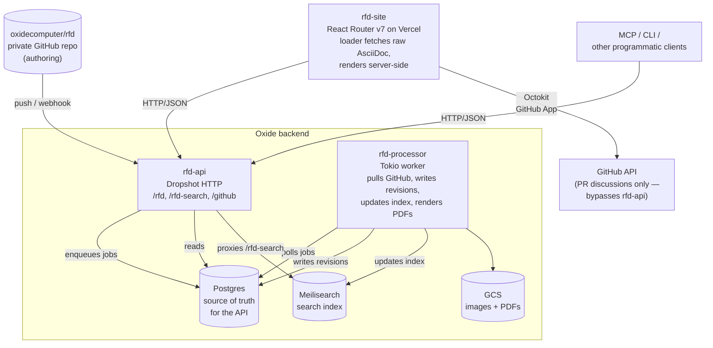
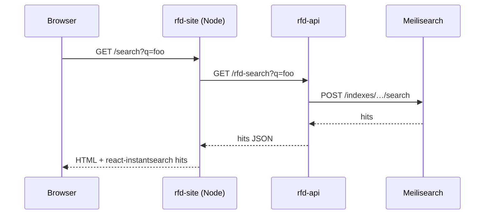
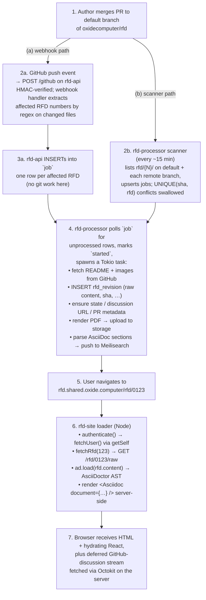

<!-- markdownlint-disable-file MD025 MD041 -->

# INV 0001: Oxide RFD system: architecture case study

**Status:** Concluded — findings informed RFC-0001 + ADR-0003 and are
baked into the rfc-api implementation (single-canonical-surface,
per-section indexing, worker-owned sync).
**Author:** Donald Gifford **Date:** 2026-04-21

<!--toc:start-->
- [Question](#question)
- [Hypothesis](#hypothesis)
- [Context](#context)
- [Approach](#approach)
- [Environment](#environment)
- [Findings](#findings)
  - [System overview](#system-overview)
  - [Repo layout](#repo-layout)
  - [rfd-api — what it actually does](#rfd-api--what-it-actually-does)
  - [rfd-processor — the second backend binary](#rfd-processor--the-second-backend-binary)
  - [rfd-site — what it actually does](#rfd-site--what-it-actually-does)
    - [Rendering pipeline (server-side)](#rendering-pipeline-server-side)
    - [Endpoints consumed](#endpoints-consumed)
    - [Search flow](#search-flow)
    - [Auth](#auth)
    - [PR discussions](#pr-discussions)
  - [The split: API vs. frontend vs. neither](#the-split-api-vs-frontend-vs-neither)
  - [End-to-end workflow: merge to visible on site](#end-to-end-workflow-merge-to-visible-on-site)
  - [Sync model: three overlapping paths](#sync-model-three-overlapping-paths)
  - [Data model](#data-model)
  - [Search](#search)
  - [Auth and access control](#auth-and-access-control)
  - [Surprises and non-obvious choices](#surprises-and-non-obvious-choices)
- [Gaps and uncertainties](#gaps-and-uncertainties)
- [Conclusion](#conclusion)
- [Recommendation](#recommendation)
- [References](#references)
<!--toc:end-->

## Question

What does Oxide's `rfd-api` service actually do, and where does the
responsibility split sit between it and `rfd-site`? Specifically: who does
Markdown/AsciiDoc rendering, search, sync from GitHub, and auth?

This is the case study we want before locking in scope for our own `rfc-api` and
`rfc-site`. We suspect the frontend handles most rendering and the API is a data
service; we need that confirmed or refuted against the actual Oxide code, not
the README narrative.

## Hypothesis

- `rfd-api` is a pure-data service (storage + search + sync); it does not render
  documents.
- `rfd-site` consumes the API over HTTP and does all rendering.
- Search is indexed on the backend and queried via the API.
- Auth is handled by the API; the site just carries tokens.

Secondary expectation: the overall shape is a straightforward "SPA + backend
REST API" — one backend binary, one frontend binary.

## Context

Triggered by [RFC-0001: rfc-api — Backend API for the Markdown
Portal][rfc-0001], which is the direct analogue of `rfd-api` in our system, and
[RFC-0011: Markdown Portal][rfc-0011], which names the Oxide RFD system as the
architectural reference.

The RFC-0001 "Scope" and "Out of scope" sections assume a split that is worth
verifying before we commit to it — if Oxide ended up splitting responsibilities
differently than we assumed, we want to know _before_ we write code.

This doc is deliberately a case study: what Oxide built, not what we should
build. Decisions about what we adopt live in the RFC and ADRs, not here.

**Triggered by:** [RFC-0001][rfc-0001], [RFC-0011][rfc-0011]

## Approach

1. Clone and read `oxidecomputer/rfd-api` (Rust) and `oxidecomputer/rfd-site`
   (TypeScript). Follow the route/endpoint definitions through to persistence
   and search.
2. Read the Cargo workspace layout and Postgres migrations to establish the data
   model and where each binary runs.
3. Read the site's loader / server code to locate the rendering pipeline.
4. Cross-reference against RFD 1 (the meta-RFD) and the Oxide blog post "A Tool
   for Discussion" for design intent.
5. Probe the live site (`rfd.shared.oxide.computer`) for surface behaviour — URL
   structure, search UX, public-vs-authenticated gating.
6. Record findings with specific file/line references so each non-trivial claim
   is auditable.

## Environment

| Component                       | Version / Value                                     |
| ------------------------------- | --------------------------------------------------- |
| `oxidecomputer/rfd-api` commit  | `d19fd17` (2026-03-23)                              |
| `oxidecomputer/rfd-site` commit | `c6ce5e6` (2026-04-17)                              |
| `oxidecomputer/rfd` (content)   | Private repo — layout inferred from consumers       |
| Backend language / framework    | Rust / Dropshot (OpenAPI-emitting)                  |
| Backend datastore               | PostgreSQL via Diesel + bb8                         |
| Backend search                  | Self-hosted Meilisearch                             |
| Backend auth                    | Shared Oxide `v-api` crate (injected into Dropshot) |
| Frontend framework              | React Router v7 (migrated from Remix)               |
| Frontend rendering              | Server-side in Node loader via `@asciidoctor/core`  |
| Frontend deploy target          | Vercel                                              |

## Findings

### System overview

The RFD system is **not** a single backend plus a single frontend. It is four
components plus the GitHub-hosted content repo:

The non-obvious bits on this diagram:

- **Two backend binaries.** `rfd-api` only validates requests and schedules
  jobs; `rfd-processor` does all the actual GitHub and Meilisearch work. They
  share the same Postgres via the `rfd-model` crate. Source:
  `rfd-api/README.md:30-53,156-157`.
- **The frontend talks to GitHub directly** for PR discussions, bypassing
  `rfd-api` entirely, using a GitHub App. Source:
  `rfd-site/app/services/github-discussion.server.ts`.
- **Rendering is on the frontend**, but on the Node loader — server-side, not
  client-side. The browser receives rendered HTML plus a hydrated React tree.
  Source: `rfd-site/app/services/rfd.server.ts:193-229`,
  `app/routes/rfd.$slug.tsx:199,321-323`.

### Repo layout

**`rfd-api` (Rust Cargo workspace, `Cargo.toml:1-14`):**

| Crate                | Role                                                                     |
| -------------------- | ------------------------------------------------------------------------ |
| `rfd-api`            | Dropshot HTTP server: reads, writes, search proxy, webhook, v-api auth   |
| `rfd-processor`      | Background worker: pulls GitHub, writes revisions, indexes, renders PDFs |
| `rfd-model`          | Diesel models + Postgres migrations                                      |
| `rfd-data`           | AsciiDoc/Markdown parsing & templates                                    |
| `rfd-github`         | GitHub client wrapper (`get_rfd_sync_updates`, branch/commit fetch)      |
| `rfd-cli`            | CLI client                                                               |
| `rfd-sdk` / `rfd-ts` | Generated Rust/TypeScript clients from `rfd-api-spec.json` (OpenAPI)     |
| `remix-auth-rfd`     | Remix auth strategy against rfd-api                                      |
| `parse-rfd`          | Section-level AsciiDoc parser used only for search indexing              |

**`rfd-site` (React Router v7, `app/`):**

- `routes/` — file-based flat routes. Key: `_index.tsx`, `rfd.$slug.tsx`
  (viewer), `search.tsx`, `auth.{google,github,magic}.{tsx,callback}.tsx`,
  `rfd.$slug.{raw,pdf,discussion}.tsx`.
- `services/*.server.ts` — server-only code. `rfd.server.ts`,
  `rfd.remote.server.ts` (API client), `rfd.local.server.ts` (dev-only
  filesystem fallback), `auth.server.ts`, `github-discussion.server.ts`.

### `rfd-api` — what it actually does

Dropshot HTTP handlers registered in `rfd-api/src/server.rs:81-133`. OpenAPI is
auto-emitted at startup (`server.rs:135-149`) and the TypeScript client is
regenerated from `rfd-api-spec.json` via `@oxide/openapi-gen-ts` — the contract
is authored in Rust, extracted, and codegen'd on both sides.

Externally visible endpoints (from `endpoints/rfd.rs`, `endpoints/webhook.rs`,
`src/search.rs`):

| Endpoint                             | Purpose                                               |
| ------------------------------------ | ----------------------------------------------------- |
| `GET /rfd`                           | List RFDs                                             |
| `GET /rfd/{number}`                  | Single RFD (metadata + latest revision)               |
| `GET /rfd/{number}/raw`              | **Raw AsciiDoc/Markdown source** — what the site uses |
| `GET /rfd/{number}/pdf`              | Pre-rendered PDF (produced by the processor)          |
| `GET /rfd/{number}/attr/{attr}`      | Individual frontmatter attribute                      |
| `GET /rfd/{number}/revision/...`     | Historical revisions                                  |
| `GET /rfd-search`                    | Proxies to Meilisearch with a bearer secret           |
| `POST /github`                       | Webhook — HMAC-verified, enqueues jobs                |
| `POST /rfd`, `POST /rfd/{n}/state/*` | Writes (used by CLI / automation, not the site)       |
| v-api endpoints                      | OAuth, magic-link, device flow, groups, mappers       |

The key observation: the API **serves raw source, not rendered HTML.** The
`RfdWithRaw.content: Option<String>` field (`rfd-api/src/context.rs:122-140`)
contains the stored AsciiDoc or Markdown text, with a `ContentFormat` enum
distinguishing the two (migration `2023-01-20-203139_rfd_revision/up.sql:1`).

The API itself does not perform git operations. Per `rfd-api/README.md:156-157`:

> `rfd-api` server does not perform RFD updates. It is responsible only for
> validating calls and scheduling update jobs.

The webhook handler (`endpoints/webhook.rs:23-57`) does one thing: HMAC-verify
the payload, extract affected RFD numbers by regex (`^rfd/(\d{4})/` against the
push event's file list at `webhook.rs:92-97`), and insert one `job` row per
affected RFD.

### `rfd-processor` — the second backend binary

This is the piece that would be easy to miss from a README-only read.
`rfd-processor` is a separate Tokio worker binary in the same Cargo workspace
(`Cargo.toml:1-14`). It:

1. Polls the `job` table for unprocessed entries
   (`rfd-processor/src/processor.rs:42-49`).
2. Marks the job `started` and spawns a Tokio task under a semaphore.
3. Runs the `RfdUpdater` pipeline (`updater/mod.rs:24-40`), whose actions
   include: `copy_images_to_storage`, `create_pull_request`,
   `ensure_default_state`, `ensure_pr_state`, `process_includes`,
   `update_discussion_url`, **`update_pdfs`**, **`update_search_index`**,
   `update_pull_request`.
4. Separately runs a scanner (`scanner.rs`) on a `tokio::time::interval`
   (default 15 min per `README.md:162`) that lists all RFDs on the default
   branch plus each remote branch and upserts jobs, relying on
   `UNIQUE(sha, rfd)` to dedupe.

PDF rendering uses `asciidoctor-pdf`, `mermaid-cli`, and `rouge`
(`rfd-api/README.md:44-52`). The processor writes the PDF and uploads images to
Google Cloud Storage (`google-storage1` in `Cargo.toml:36`).

`update_search_index.rs:30-46` hands the raw revision content to
`RfdSearchIndex::index_rfd`, which parses the AsciiDoc into sections
(`parse-rfd` crate) and pushes each section as a separate Meilisearch document
with a `public: bool` visibility flag — so Meilisearch stores per-section docs,
not per-RFD.

### `rfd-site` — what it actually does

#### Rendering pipeline (server-side)

1. `services/rfd.server.ts:193-229` (`apiRfdToItem`): receives
   `RfdWithRaw.content` (the raw AsciiDoc string) from the API, calls
   `ad.load(rfd.content, { sourcemap: true })` using `@asciidoctor/core`, then
   `handleDocument(doc)` from `@oxide/design-system/asciidoc` to produce a
   `DocumentBlock` AST.
2. `routes/rfd.$slug.tsx:199,321-323` renders it with
   `<Asciidoc document={content} options={opts} />` from
   `@oxide/react-asciidoc`.
3. The browser gets server-rendered HTML plus the hydrated React tree.

Rendering runs **in the React-Router loader on the Node server** — neither the
Rust API nor the browser client does it. Mermaid, Shiki, highlight.js, and
`marked` are bundled for diagrams, syntax highlighting, and Markdown support
(`rfd-data` supports either format).

#### Endpoints consumed

Via the generated `@oxide/rfd.ts` client (`services/rfd.remote.server.ts`):
`listRfds`, `viewRfd` (→ `/rfd/{n}/raw` returning `RfdWithRaw`), `viewRfdPdf`,
`searchRfds`, `listJobs`, `getGroups`, plus `getSelf` in `auth.server.ts:47`.
The token is injected as a bearer via `ApiWithRetry`
(`rfd.remote.server.ts:66-74`).

In local dev, setting `LOCAL_RFD_REPO=...` makes the site read `.adoc` files
directly from disk via `rfd.local.server.ts` — the API is skipped entirely, no
auth, no search.

#### Search flow

The site reshapes Meilisearch hits into the Algolia-DocSearch shape that
`react-instantsearch` expects (`routes/search.tsx:23-107`), because Meilisearch
stores documents with `hierarchy_lvl0..5` fields mirroring that schema.

#### Auth

Three `remix-auth` strategies (`services/auth.server.ts:89-130`): Google OAuth,
GitHub OAuth, and magic link — **all minted by `rfd-api`**, not passed through
from the upstream provider. `rfd-api` discards the Google/GitHub token after
identity verification and issues its own JWT (rfd-api README.md:252-254).

Access decisions on the site are mostly cosmetic. The viewer route
(`rfd.$slug.tsx:211`) checks `user?.groups.some(g => g === 'oxide-employee')` to
toggle UI, with a comment explicitly noting the check is "merely cosmetic" —
authorization is enforced in the API via v-api permissions.

#### PR discussions

The site's `github-discussion.server.ts` hits GitHub's API directly with
Octokit, using a GitHub App credential (`GITHUB_APP_ID`,
`GITHUB_INSTALLATION_ID`, `GITHUB_PRIVATE_KEY`; `rfd-site/README.md:112-114`).
This is the one place where the site bypasses `rfd-api` and talks to GitHub
itself.

### The split: API vs. frontend vs. neither

| Concern                           | `rfd-api` (Rust)                                 | `rfd-site` (TypeScript)                   |
| --------------------------------- | ------------------------------------------------ | ----------------------------------------- |
| GitHub ingest                     | **Yes** (webhook + scanner → jobs)               | No, except PR discussions via Octokit App |
| Persistence                       | **Yes** (Postgres: RFDs, revisions, jobs, users) | Stateless                                 |
| Search indexing                   | **Yes** (processor → Meilisearch)                | No                                        |
| Search queries                    | Proxies to Meilisearch                           | Calls `/rfd-search`, reshapes for UI      |
| Auth / token issuance             | **Yes** (OAuth, device code, magic-link, JWT)    | Consumes tokens; manages cookie session   |
| AsciiDoc / Markdown **parsing**   | Partial (metadata + section split for search)    | Full (parse AST for render)               |
| AsciiDoc / Markdown **rendering** | **Never**                                        | **Yes** (server-side `@asciidoctor/core`) |
| PDF generation                    | **Yes** (processor action)                       | Links out to PDFs                         |
| Image hosting                     | **Yes** (processor uploads to GCS)               | Consumes signed URLs                      |
| PR comments / discussion          | No (endpoint exists but unimplemented)           | **Yes** (direct GitHub App via Octokit)   |
| Authoring                         | **No** — happens in the private `oxide/rfd` repo | **No** — same                             |

Plain-English summary:

> **API does:** storage, sync from GitHub, search indexing, auth issuance, PDFs.
> **Site does:** rendering, UI, session, PR comment rendering. **Neither does:**
> authoring — that happens on GitHub, in a private content repo.

### End-to-end workflow: merge to visible on site

Key property: the Rust API is **not on the hot path for rendering**. It serves
raw source; every page render re-parses and re-renders on the Node server.
Caching is at the HTTP layer of `rfd-site`, not in a pre-rendered HTML store.

### Sync model: three overlapping paths

Oxide runs three reconciliation paths that converge on the `job` table:

1. **Webhook** — low-latency, best-effort. One push → one or more rows.
2. **Scanner** — 15-min scan that catches webhook misses and branch state.
3. **Processor poll** — independent loop that picks up any unprocessed row
   regardless of who inserted it.

`UNIQUE(sha, rfd)` on the `job` table makes insertion idempotent; conflicts are
ignored (`scanner.rs:40-48`). Failed jobs remain un-completed and are retried by
the next poll — there's a `TODO: Mark job as failed or retry?` comment at
`processor.rs:124-128`, so semantics here are loose by design.

Per `rfd-api/README.md:104`, "Force pushes may result in the removal of the
commit that triggered a revision" — the system does not attempt to backfill lost
revisions.

### Data model

Postgres via Diesel migrations (`rfd-model/migrations/`):

| Table          | Key columns                                                                                                                                       |
| -------------- | ------------------------------------------------------------------------------------------------------------------------------------------------- |
| `rfd`          | `id UUID`, `rfd_number`, `link`, `visibility ENUM('public','private')` (default `'private'`)                                                      |
| `rfd_revision` | `rfd_id FK`, `title`, `state`, `discussion`, `authors`, `content`, `content_format`, `sha`, `commit_sha`, `committed_at`; UNIQUE(`rfd_id`, `sha`) |
| `rfd_pdf`      | PDF linked to revision; external storage id                                                                                                       |
| `job`          | `owner`, `repository`, `branch`, `sha`, `rfd`, `webhook_delivery_id`, `processed`, `started`; UNIQUE(`sha`, `rfd`)                                |
| v-api tables   | Users, groups, mappers, permissions (migration `2024-11-12-141610_v_api_conversion`)                                                              |

Two points worth noting:

- **Every revision is persisted**, not just the latest. The site can fetch
  historical revisions via `GET /rfd/{n}/revision/…`.
- **Images are not in Postgres.** They are uploaded to GCS by the processor and
  served via signed URLs minted by the site.

### Search

- Engine: self-hosted **Meilisearch**.
- Index population: `rfd-processor` action `update_search_index`, on each new
  revision.
- Document granularity: **one Meilisearch document per AsciiDoc section**, with
  `hierarchy_lvl0..5` fields mirroring the Algolia DocSearch schema. That is why
  `react-instantsearch` works directly against it with a reshape.
- Visibility propagates into the index as a `public: bool` field on each section
  doc.
- Queries: the site calls `rfd-api GET /rfd-search`, which POSTs to
  `{meili_endpoint}/indexes/{index}/search` with a bearer secret
  (`rfd-api/src/search.rs:42-55`).

### Auth and access control

- Strategies: Google OAuth, GitHub OAuth, OAuth device flow, magic link (Resend
  email).
- Token model: `rfd-api` **issues its own JWTs**; upstream provider tokens are
  used only for identity verification and discarded.
- Permissions: coarse scopes (`rfd:content:r`, `search`, `user:info:r`, …); the
  default for unauthenticated callers is `SearchRfds` only
  (`rfd-api/src/main.rs:155`).
- Group membership via **mappers** (e.g.
  `email_domain = "oxide.computer" → groups = ["oxide-employee"]`) assigned at
  login time.
- Enforcement: on the **API**, via v-api permissions on each endpoint. The
  site's employee-only UI checks are flagged as "merely cosmetic" in source
  (`rfd.$slug.tsx:211`).
- Visibility on search: Meilisearch docs carry `public: bool`. The exact filter
  expression that scopes anonymous searchers to public docs was not located in
  `search.rs` — it may be enforced by Meilisearch API keys (per-scope search
  keys) rather than query filters. See [Gaps](#gaps-and-uncertainties).

### Surprises and non-obvious choices

1. **Rendering is on the frontend, server-side.** Not the Rust API, not the
   browser — the Node loader. Hypothesis **confirmed**.
2. **Two backend binaries, one repo.** `rfd-api` is a scheduler; `rfd-processor`
   is the worker. Both use the same `rfd-model` Postgres crate. Our mental model
   of "one API binary" would miss this.
3. **Three-tier redundant sync.** Webhook + 15-min scanner + processor poll,
   deduped by `UNIQUE(sha, rfd)`. This is a deliberate design for resilience;
   webhooks alone would be fragile.
4. **OpenAPI is the source of truth for clients.** Dropshot auto-emits
   `rfd-api-spec.json`; Rust SDK, TypeScript SDK, and `rfd-cli` are all
   generated. The contract is authored in Rust handlers, not in a separate
   schema file.
5. **Auth is a separate Oxide product.** `v-api` is its own crate, injected via
   the `v_system_endpoints!` and `inject_endpoints!` macros (`server.rs:46,79`).
   RFDs are one application of it.
6. **Per-section search docs.** Makes search results land on the correct
   subheading, and makes Algolia-style client UIs work off the shelf.
7. **PR discussions bypass the API.** The site talks to GitHub directly via an
   App credential. An asymmetry — discussions are not persisted in Postgres, and
   are not available to non-frontend consumers.
8. **Local-dev short-circuit.** `LOCAL_RFD_REPO` makes the site read `.adoc`
   files off disk, skipping the API, auth, and search entirely.
9. **Images and PDFs in object storage, not Postgres.** The database is for
   structured data; binary assets go to GCS.
10. **Deployment is split.** The site runs on Vercel; the API and processor are
    self-hosted alongside Postgres and Meilisearch. There is no single "deploy
    the RFD system" artifact.

## Gaps and uncertainties

Called out explicitly; not filled with plausible guesses:

- **Deployment topology for the backend** — where `rfd-api`, `rfd-processor`,
  Postgres, and Meilisearch actually run is not in either public repo. Blog post
  says "self-hosted Meilisearch"; the rest is inferred.
- **Content repo internals.** `oxidecomputer/rfd` is private. The
  `rfd/{number}/README.adoc` convention is inferred from the webhook regex and
  the GitHub client code; not directly verified.
- **Meilisearch public/private filtering.** The `public` field is stored, but
  the filter expression that scopes anonymous search was not found in
  `search.rs`. Likely enforced via per-scope Meilisearch API keys; unverified.
- **SSR vs. streaming under React Router v7.** Blog post predates the migration
  from Remix. The deferred-response streaming pattern for discussions may behave
  differently under RRv7; not tested.
- **`v-api` internals.** Token-issuance claims come from `rfd-api` README and
  config, not from reading the `v-api` crate itself.
- **Short URL service** (`{num}.rfd.oxide.computer`, referenced in RFD 1) is not
  implemented in either repo. Presumed to be a DNS or edge-redirect layer.

## Conclusion

**Answer:** Hypothesis confirmed, with one structural correction.

Confirmed:

- `rfd-api` is a pure-data service. It stores raw AsciiDoc/Markdown source and
  metadata, proxies search, issues auth tokens, and coordinates an async
  pipeline. **It never renders to HTML.**
- `rfd-site` is the rendering tier. The Node loader parses AsciiDoc with
  `@asciidoctor/core` and emits HTML server-side on every request.
- Search is indexed on the backend (Meilisearch, by the processor) and queried
  through the API.
- Auth is owned by the API; the site carries tokens and does cosmetic gating
  only.

Corrected:

- The backend is **two binaries**, not one. `rfd-api` (Dropshot server)
  validates requests and schedules jobs; `rfd-processor` (Tokio worker) does all
  GitHub and Meilisearch work. Missing this would underestimate the
  implementation effort and would shape any deploy topology we copy from them.

Additional notable departures from the naive "API + SPA" mental model:

- Three overlapping sync paths (webhook, scanner, processor poll).
- OpenAPI-first client generation for all consumers.
- PR discussions fetched directly from GitHub by the frontend, bypassing the
  API.

## Recommendation

Feed these findings back into the in-flight docs:

1. **Update [RFC-0001][rfc-0001]** to reflect that the backend side of the
   portal is likely a **scheduler + worker** pair in one service (or two), not a
   single process. The "Design" and "Implementation Phases" sections should
   acknowledge the async processor as a first-class component, not an
   implementation detail.
2. **Close the Meilisearch open question in RFC-0001** informed by Oxide's
   model: Oxide puts search _behind_ the API, proxied from the Rust service,
   with the index populated by the async processor. That argues for Meilisearch
   living with `rfc-api` if we want the MCP and other programmatic clients to
   get search for free. Capture the decision in a follow-up ADR.
3. **Add an RFC for `rfc-site`** (not yet written) that commits to server-side
   Markdown rendering in the frontend tier, consuming raw content from
   `rfc-api`. Reference this INV as the basis.
4. **Decide whether PR-discussion integration belongs in `rfc-api` or in
   `rfc-site`.** Oxide splits it to the frontend; we may want to persist it via
   the API so that MCP/automation can see it. Capture as a future open question.
5. **Do not copy Oxide's auth stack wholesale.** Their custom-JWT-issuance
   posture requires the `v-api` crate; we stated auth is out of v1 scope in
   RFC-0001 and this finding does not change that. Revisit when auth is in
   scope.

## References

- [RFC-0001: rfc-api — Backend API for the Markdown Portal][rfc-0001]
- [RFC-0011: Markdown Portal][rfc-0011]
- [ADR-0001: Use Go and the standard library net/http for rfc-api][adr-0001]
- [ADR-0002: Use PostgreSQL as the rfc-api datastore][adr-0002]
- Oxide: [`oxidecomputer/rfd-api`](https://github.com/oxidecomputer/rfd-api)
  (commit `d19fd17`, 2026-03-23)
- Oxide: [`oxidecomputer/rfd-site`](https://github.com/oxidecomputer/rfd-site)
  (commit `c6ce5e6`, 2026-04-17)
- Oxide:
  [RFD 1 — Requests for Discussion](https://rfd.shared.oxide.computer/rfd/0001)
- Oxide: [`rfd.shared.oxide.computer`](https://rfd.shared.oxide.computer/) (live
  site)
- Oxide blog:
  [A Tool for Discussion](https://oxide.computer/blog/a-tool-for-discussion)

[rfc-0001]: ../rfc/0001-rfc-api-backend-api-for-the-markdown-portal.md
[rfc-0011]: ../../INGEST_RFC.md
[adr-0001]: ../adr/0001-use-go-and-stdlib-net-http-for-rfc-api.md
[adr-0002]: ../adr/0002-use-postgresql-as-the-rfc-api-datastore.md
