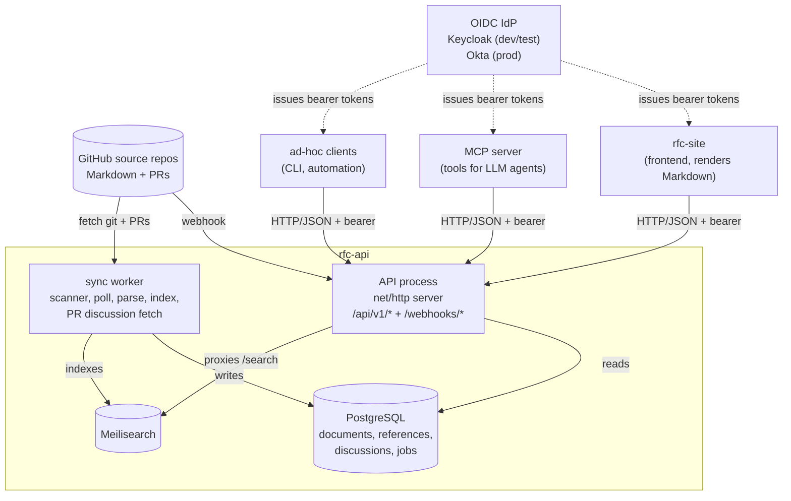

<!-- markdownlint-disable-file MD025 MD041 -->

# RFC 0001: rfc-api: Backend API for the Markdown Portal

**Status:** Accepted — Phases 1–3 shipped (IMPL-0001..0005); Phase 4
(auth + MCP polish) remains.
**Author:** Donald Gifford **Date:** 2026-04-21

<!--toc:start-->
- [Summary](#summary)
- [Problem Statement](#problem-statement)
- [Proposed Solution](#proposed-solution)
- [Design](#design)
  - [Scope](#scope)
  - [Content model (at the API boundary)](#content-model-at-the-api-boundary)
  - [API surface (indicative)](#api-surface-indicative)
  - [Service composition (API + worker)](#service-composition-api--worker)
  - [Sync](#sync)
  - [Technology choices (summary)](#technology-choices-summary)
  - [Relationship to other components](#relationship-to-other-components)
- [Alternatives Considered](#alternatives-considered)
- [Implementation Phases](#implementation-phases)
  - [Phase 1: Single-source read-only MVP](#phase-1-single-source-read-only-mvp)
  - [Phase 2: Search, discussions, and webhook-driven sync](#phase-2-search-discussions-and-webhook-driven-sync)
  - [Phase 3: Multiple sources and the third content type](#phase-3-multiple-sources-and-the-third-content-type)
  - [Phase 4: Auth and MCP-ready API polish](#phase-4-auth-and-mcp-ready-api-polish)
- [Risks and Mitigations](#risks-and-mitigations)
- [Open Questions](#open-questions)
  - [Resolved open questions](#resolved-open-questions)
- [Success Criteria](#success-criteria)
- [References](#references)
<!--toc:end-->

## Summary

`rfc-api` is the backend service for the Markdown Portal described in [RFC-0011:
Markdown Portal][rfc-0011]. It ingests Markdown documents from configured GitHub
source repos, persists them and their metadata, and exposes them as a read-only
HTTP JSON API consumed by the portal's web frontend (`rfc-site`), by the MCP
server, and by any other programmatic client.

This RFC scopes the service itself — its responsibilities, the shape of what it
exposes, and what it does _not_ own. It does not specify internal implementation
details; those live in ADRs and design docs.

## Problem Statement

RFC-0011 proposes a Git-based, PR-driven workflow for RFCs, ADRs, and other
Markdown content types, modeled on Oxide's [rfd-site][rfd-site] /
[`rfd-api`][rfd-repo]. GitHub handles authoring and review; it does not handle
readable rendering, corpus-wide search, programmatic access, or a consistent
reading experience across content types.

RFC-0011 sketches a five-part system: GitHub source → sync → API + search index
→ frontend → MCP server. `rfc-api` is the **API + sync + storage** slice of that
system. Without a canonical programmatic surface over the document corpus, every
consumer (frontend, MCP, automation, cross-service linking) has to solve
fetching, parsing, and search on its own. `rfc-api` exists so they do not.

## Proposed Solution

A backend system composed of two cooperating processes that share a Postgres
database and together present `rfc-api` as a single logical service:

1. A **read-facing API** (the HTTP server). Accepts read traffic, validates
   incoming requests, proxies search queries, handles GitHub webhooks by
   enqueueing ingest jobs, and enforces access control. Does no git work and no
   content parsing on the request path.
2. A **sync worker**. Runs on a timer plus picks up jobs enqueued by the API
   (via webhook) and by its own scanner. Pulls content from configured GitHub
   sources, parses Markdown + frontmatter, persists documents and their
   cross-references, pulls PR discussions, and updates the search index.

Both processes ship from the same Go module (and potentially the same binary in
two modes) but are separately scheduled, so long-running sync work never shares
request latency with the read API.

The system as a whole:

- **Syncs** from one or more configured GitHub source repos on a timer, with
  webhook-triggered out-of-band refresh.
- **Parses** Markdown files into typed documents (RFCs and ADRs for v1; the
  parser set is extensible for future content types) and persists them with
  their frontmatter, body, and derived metadata.
- **Persists PR discussions** (review comments and conversations) for each
  document so programmatic consumers — including the MCP server — see the same
  context a human reader sees on GitHub.
- **Serves** a versioned JSON HTTP API over the persisted corpus: list, fetch by
  id, cross-reference, full-text search, discussion, and source/health
  introspection.
- **Emits structured data** in a shape the MCP server and the frontend can both
  consume without either of them reaching into storage directly.

The repo remains the source of truth; `rfc-api`'s store is a rebuildable cache.
The rationale for splitting into an API + worker (rather than a single process)
is discussed in [Alternatives Considered](#alternatives-considered); the pattern
is the same one Oxide landed on in their RFD system (see [INV-0001][inv-0001]).

## Design

### Scope

In scope for `rfc-api`:

- GitHub sync (scheduled + webhook-triggered reconciliation), driven by the sync
  worker.
- Markdown + frontmatter parsing for v1 content types (RFC, ADR).
- **PR discussion ingest and persistence.** Per-document review comments and
  conversations are pulled from GitHub by the worker and stored alongside the
  document, so any consumer of the API (including the MCP server) sees them.
  Fetching PR discussions from GitHub on the read path is explicitly not the
  design — this differs from the Oxide RFD system, where `rfd-site` calls GitHub
  directly (see [INV-0001][inv-0001]).
- Persistence of documents, their metadata, cross-references, and discussion
  threads in PostgreSQL.
- Read API (documents, lists, cross-references, search, discussion, sources,
  health).
- Operational surface (metrics, logs, health endpoints) suitable for deployment
  on our existing Kubernetes cluster.

Out of scope for `rfc-api` (owned elsewhere):

- **Web UI, rendering, and visual design.** Owned by `rfc-site` (see
  [RFC-0002][rfc-0002]) and RFC-0012 (design system). `rfc-api` serves raw
  Markdown; rendering to HTML happens in `rfc-site`.
- **MCP server.** Thin adapter over this API; versioned and released
  independently. May live in a separate repo.
- **Authoring.** Writing and reviewing continue to happen in Git. `rfc-api` is
  strictly read-only with respect to the source repos.
- **Identity provider and directory.** `rfc-api` consumes an external
  OIDC/OAuth2 IdP (Keycloak for test, Okta for production) — it does not issue
  its own credentials or manage users. See
  [Technology choices](#technology-choices-summary) and Phase 4.

### Content model (at the API boundary)

A **content source** is a GitHub repo (or a path within one) plus a content
type. Sources are configured statically at deploy time.

A **document** is the unit the API returns. Its externally visible shape is:

- An identifier (type prefix + number, e.g. `RFC-0011`, `ADR-0002`).
- A title, status, author, creation date, and free-form labels from frontmatter.
- A Markdown body (original, unrendered — rendering is a client concern).
- A set of cross-document references extracted from the body.
- A link to the canonical source file in GitHub.
- A **discussion thread** — the set of PR review comments and conversations
  associated with the document's most recent merged PR — fetched by the sync
  worker and cached in Postgres, exposed via a separate endpoint.

Different content types are parsed by type-specific logic but expose the same
document shape. Adding a future type (frameworks, runbooks, etc.) does not
change the API contract.

### API surface (indicative)

The API is versioned under `/api/v1/` and structured as **per-type URL prefixes
plus a small cross-type aggregation surface**. Exact shapes are finalized in the
design docs; the endpoints below describe the intent:

```
Operational:
  GET  /healthz                           liveness
  GET  /readyz                            readiness
  GET  /metrics                           Prometheus scrape

Cross-type (corpus-wide):
  GET  /api/v1/types                      registered document types
  GET  /api/v1/docs                       paginated list across all types
  GET  /api/v1/search?q=...               cross-type full-text search

Per-type (one set per registered document type):
  GET  /api/v1/{type}                     paginated list of that type
  GET  /api/v1/{type}/{id}                single document
  GET  /api/v1/{type}/{id}/links          cross-references (in + out)
  GET  /api/v1/{type}/{id}/discussion     PR review comments + conversations
  GET  /api/v1/{type}/{id}/revisions      revision history (Phase 2+)
  GET  /api/v1/{type}/{id}/authors        author metadata

Webhook:
  POST /api/v1/webhooks/github            GitHub webhook receiver (signed)
```

Conventions (full treatment in [DESIGN-0002 #URL structure][design-0002-url]):

- `{type}` is a lowercase registered type id (`rfc`, `adr`, `framework`).
  Unknown types 404 at the router.
- `{id}` is the numeric portion, zero-padded (`0001`). The canonical display
  form returned in JSON bodies is `RFC-0001` — a single globally unique string
  used for storage, cross-references, and logs.
- Both list endpoints (`/api/v1/docs` and `/api/v1/{type}`) are paginated with
  `?limit=` and an opaque `?cursor=`; navigation metadata rides in `Link` and
  `X-Total-Count` headers. Bare JSON arrays in the body.

The API is JSON, read-only, rate-limited, and initially open on the internal
network. It is the _canonical_ programmatic surface: the frontend and the MCP
server both consume it; neither reads storage directly.

Why per-type URL prefixes were chosen over a unified `/api/v1/docs/{id}` surface
with a `?type=` query parameter: human- and LLM-readable URLs
(`/api/v1/rfc/0001` is self-documenting); clean slots for type-specific
sub-resources (`/api/v1/framework/{id}/controls`) and per-type auth scopes
(`framework:read`) if those needs materialize; cleaner cache and rate-limit
keying on URL paths. Cross-type aggregation is preserved via `/api/v1/docs` and
`/api/v1/search` so MCP and corpus-wide consumers still have one surface for
"everything."

### Service composition (API + worker)

`rfc-api` is two cooperating processes around one Postgres database:

- The **API process** serves all HTTP read traffic and terminates the GitHub
  webhook. On webhook receipt it validates the signature, extracts affected
  documents, and inserts one job row per affected document. It performs no git
  fetches and no Markdown parsing on the request path.
- The **sync worker process** owns ingest. It polls the job table, pulls content
  and PR discussions from GitHub, parses Markdown and frontmatter, updates the
  persisted corpus, and refreshes the search index.

The two processes communicate via Postgres. There is no direct RPC between them;
the job table is the queue. This keeps the API fast and stateless per-request,
lets the worker scale independently (or be paused for maintenance without taking
the read API down), and means the read API does not hold open any long-running
GitHub sessions.

Both processes are built from the same Go module; whether they ship as one
binary with two sub-commands or as two binaries is a design-doc-level choice.

### Sync

Ingest follows a three-path reconciliation model, modeled on Oxide's (see
[INV-0001 #Sync model][inv-0001]):

1. **Webhook** — low-latency path. The API's `POST /api/v1/webhooks/github`
   endpoint verifies the GitHub HMAC signature, identifies affected documents by
   path, and inserts one job per document.
2. **Scanner** — the sync worker periodically lists all documents in each
   configured source and inserts jobs for any it hasn't seen. Catches webhook
   misses.
3. **Processor poll** — the worker polls for unprocessed jobs continuously,
   running ingest actions (fetch, parse, persist, extract links, fetch PR
   discussion, update search index).

Jobs are deduplicated by a unique key on `(content-sha, document-id)`. The sync
loop is idempotent: a full rebuild of the store from Git must always produce the
same state. Partial failures must not leave the store in an inconsistent state
visible to readers — each job's writes are transactional.

### Technology choices (summary)

The concrete technology decisions are recorded as ADRs and referenced here:

- **Language and HTTP layer:** Go 1.26.1 with the standard library's `net/http`
  (Go 1.22+ `ServeMux`). No third-party HTTP framework. See [ADR-0001: Use Go
  and the standard library net/http for rfc-api][adr-0001].
- **Datastore:** PostgreSQL. See [ADR-0002: Use PostgreSQL as the rfc-api
  datastore][adr-0002].
- **Full-text search:** Meilisearch, deployed alongside `rfc-api` and queried
  through it. The sync worker populates the index; the API exposes
  `/api/v1/search` and proxies to Meilisearch. Consumers never address
  Meilisearch directly. See [ADR-0003: Use Meilisearch for rfc-api
  search][adr-0003].
- **Authentication (future phase):** OIDC / OAuth2 bearer tokens, validated
  against an external IdP. **Keycloak** is the test/dev IdP; **Okta** is the
  production IdP. `rfc-api` is a resource server — it does not issue tokens,
  store credentials, or own user records. v1 remains internal-network only per
  RFC-0011; OIDC integration lands in Phase 4.
- **Deployment:** Kubernetes. Packaged as a Helm chart, deployed via Argo CD
  alongside its Postgres and Meilisearch. API and sync worker run as separate
  Deployments/StatefulSets so they scale, restart, and alert independently.
  Namespace, quotas, and service topology follow the existing platform
  conventions.

### Relationship to other components



`rfc-api` has one upstream (GitHub) and multiple downstreams (`rfc-site`, MCP
server, ad-hoc programmatic consumers). All downstreams talk to it over HTTP.
The external IdP (Keycloak in dev/test, Okta in production) issues bearer tokens
that consumers present to the API; the API validates them and does not call back
to the IdP on every request.

## Alternatives Considered

1. **Bundle the API into the frontend (`rfc-site`).** Rejected. The API must be
   consumable by non-browser clients (MCP server, automation, other services).
   Coupling it to a specific frontend forecloses that and conflates two deploy
   cadences and two skill sets.
2. **Skip the service; have the frontend read GitHub directly.** Rejected. Every
   client would re-implement sync, parsing, and search; GitHub rate limits
   become everyone's problem; there is no shared rendering of cross-document
   links. This is the no-`rfc-api` baseline RFC-0011 argues against.
3. **Fork and adapt Oxide's `rfd-api`.** Rejected for the same reason RFC-0011
   rejects forking `rfd-site`: it is tightly coupled to AsciiDoc and Oxide's
   specific schema. We are borrowing the architectural shape, not the codebase.
4. **Serverless / functions-based backend.** Not pursued. Periodic sync, a
   persistent search index, and low-latency read traffic fit a long-running
   service better than a per-request function model. Also at odds with the
   existing Kubernetes deployment target.
5. **Single monolithic process (no API/worker split).** A simpler alternative
   where one process serves HTTP, runs the scanner, and processes ingest
   in-process. Rejected. Sync work (git fetches, PR comment pulls, full
   re-indexing) is long-running and bursty; keeping it out of the read-serving
   process gives independent restarts, no request-latency impact during reindex,
   and a natural unit to scale horizontally as the corpus grows. Oxide reached
   the same conclusion ([INV-0001][inv-0001] #rfd-processor).
6. **Read PR discussions from GitHub on the request path** (frontend or API
   calls Octokit per-view). Rejected. That approach leaves discussions invisible
   to the MCP server and to other non-browser consumers, and ties read latency
   to GitHub API health and rate limits. Worker-persisted discussions solve
   both. This is a deliberate departure from the Oxide RFD design, where
   `rfd-site` fetches PR comments directly ([INV-0001][inv-0001] #PR
   discussions).

## Implementation Phases

### Phase 1: Single-source read-only MVP

One configured GitHub source, RFC + ADR parsers, Postgres-backed storage,
`GET /docs`, `GET /docs/{id}`, `GET /healthz`. API and worker are already split
from day one — the worker runs timer-based sync and the `jobs` table is in place
— but search, webhooks, and PR discussions are deferred. Internal-network deploy
on the cluster. Goal: validate the API/worker split and the sync-parse-serve
path end-to-end with one content type.

### Phase 2: Search, discussions, and webhook-driven sync

Stand up Meilisearch (per [ADR-0003][adr-0003]) and wire the worker to index on
each ingest. Add the `/search`, `/docs/{id}/links`, and `/docs/{id}/discussion`
endpoints. Add webhook-triggered reconciliation (`POST /api/v1/webhooks/github`)
and the worker's PR-discussion fetch.

### Phase 3: Multiple sources and the third content type

Validate the generic-document abstraction by onboarding a second source repo and
a content type that is not RFC or ADR (candidate per RFC-0011: security
frameworks generated from HCL tooling). Harden the parser-plugin seam.

### Phase 4: Auth and MCP-ready API polish

Add OIDC/OAuth2 bearer-token validation against Keycloak (dev/test) and Okta
(production). Model permissions at the scope level (`docs:read`, `search`, etc.)
— coarse by design for v1. Add rate limits for non-internal-network consumers.
Tighten the API contract and response shapes based on real MCP usage. SSO in the
browser is owned by `rfc-site` ([RFC-0002][rfc-0002]).

## Risks and Mitigations

| Risk                                                           | Impact | Likelihood                         | Mitigation                                                                                                                                    |
| -------------------------------------------------------------- | ------ | ---------------------------------- | --------------------------------------------------------------------------------------------------------------------------------------------- |
| Store drifts from Git and users see stale content              | Medium | Medium                             | Short reconcile interval; webhook-triggered refresh; store is rebuildable from Git on demand                                                  |
| GitHub rate limits throttle sync at scale                      | Medium | Low early, rising with corpus size | Use conditional requests + webhooks; per-source sync scheduling; back off on 4xx/5xx                                                          |
| API contract churn breaks frontend and MCP in lockstep         | High   | Medium                             | Version the API from day one (`/api/v1/`); additive changes only within a version; deprecation policy before breaking changes                 |
| Parser for a new content type leaks shape into the core        | Medium | Medium                             | Document shape is fixed at the API boundary; parser plugins adapt to it, not the reverse. Enforced via phase-3 spike                          |
| Search component is wrong for the corpus                       | Low    | Low                                | Search is behind the API; swapping the backing index does not change the contract                                                             |
| Two-process operational overhead (API + worker)                | Medium | Medium                             | Single Helm chart; shared image/module; shared observability; worker is stateless modulo the jobs table                                       |
| PR discussions drift or are lost on force-push                 | Low    | Medium                             | Treat discussion as best-effort cache with a `last_synced_at`; expose staleness in the API; prompt re-fetch on read-after-write is not a goal |
| OIDC provider outage blocks authenticated reads (post-phase-4) | Medium | Low                                | Validate JWTs locally against cached JWKS; cache signing keys with TTL; unauthenticated internal-network path remains for break-glass         |

## Open Questions

1. **Sync cadence and webhook handling.** Exact reconcile interval and whether
   webhooks are authoritative or advisory is deferred to a design doc.
2. **Content-type extensibility seam.** Whether parsers are compiled in,
   plugin-loaded, or config-driven is deferred until phase 3 forces the
   decision.
3. **Discussion data-model granularity.** Per-document latest-PR-only (simplest)
   vs. per-revision historical discussion (richer context) vs. line-anchored
   mapping (Oxide-style, but significantly harder). v1 assumes latest-PR-only;
   revisit when consumers push back.
4. **`docz` at runtime vs. convention-only.** Consistent with RFC-0011: v1
   treats `docz` as a source of authoring conventions only; `rfc-api` parses
   whatever the repo contains and does not depend on `docz` tooling at runtime.

### Resolved open questions

- **Where does search live?** Behind `rfc-api`, populated by the sync worker,
  queried through `/api/v1/search`. Meilisearch is the engine. Resolved in
  [ADR-0003][adr-0003], informed by [INV-0001][inv-0001].
- **PR discussion location.** Persisted in `rfc-api` so MCP and other
  non-browser consumers can see the same context as the frontend. Deliberate
  departure from Oxide's model.
- **API + worker as one binary or two.** One binary with two sub-commands
  (`rfc-api serve`, `rfc-api work`). Simplifies the container image and Helm
  chart; split into two binaries only if worker-specific dependencies start
  bloating the API image or if independent scaling becomes awkward. Resolved in
  [DESIGN-0001][design-0001] #Resolved Decisions.

## Success Criteria

- The `rfc-site` frontend and an MCP server can both be built against `rfc-api`
  without either reaching around it to GitHub or to storage.
- A merge to a configured source repo is reflected in the API within the agreed
  reconcile interval.
- Adding a third content type in phase 3 requires no breaking changes to the
  `/api/v1/` contract.
- The store is fully rebuildable from Git; a wipe-and-resync is a routine
  operation, not an incident.
- v1 ships on the existing Kubernetes cluster using the standard Helm / Argo
  pipeline, with no service-specific platform work.

## References

- [RFC-0011: Markdown Portal][rfc-0011] — parent RFC; defines the overall portal
  of which `rfc-api` is the backend slice.
- [RFC-0002: rfc-site — Web Frontend for the Markdown Portal][rfc-0002] —
  sibling RFC for the read-facing web UI.
- [INV-0001: Oxide RFD system — architecture case study][inv-0001] — the Oxide
  reference architecture this RFC borrows from (and deliberately departs from in
  two places).
- [ADR-0001: Use Go and the standard library net/http for rfc-api][adr-0001]
- [ADR-0002: Use PostgreSQL as the rfc-api datastore][adr-0002]
- [ADR-0003: Use Meilisearch for rfc-api search][adr-0003]
- [DESIGN-0001: rfc-api HTTP server — Go + net/http structure][design-0001]
- [DESIGN-0002: DocumentType extensibility for multiple content
  types][design-0002]
- Oxide's [rfd-site][rfd-site] and [`rfd-site`][rfd-repo] — architectural
  reference; implementation is not borrowed.
- [RFD 1, #Tooling][rfd-tooling] — framing for the read experience, search, and
  inter-document linking.

[rfc-0002]: ./0002-rfc-site-web-frontend-for-the-markdown-portal.md
[rfc-0011]: ../../INGEST_RFC.md
[inv-0001]: ../investigation/0001-oxide-rfd-system-architecture-case-study.md
[adr-0001]: ../adr/0001-use-go-and-stdlib-net-http-for-rfc-api.md
[adr-0002]: ../adr/0002-use-postgresql-as-the-rfc-api-datastore.md
[adr-0003]: ../adr/0003-use-meilisearch-for-rfc-api-search.md
[design-0001]: ../design/0001-rfc-api-http-server-go-net-http-structure.md
[design-0002]:
  ../design/0002-documenttype-extensibility-for-multiple-content-types.md
[design-0002-url]:
  ../design/0002-documenttype-extensibility-for-multiple-content-types.md#url-structure
[rfd-site]: https://rfd.shared.oxide.computer/
[rfd-repo]: https://github.com/oxidecomputer/rfd-site
[rfd-tooling]: https://rfd.shared.oxide.computer/rfd/0001#_tooling
