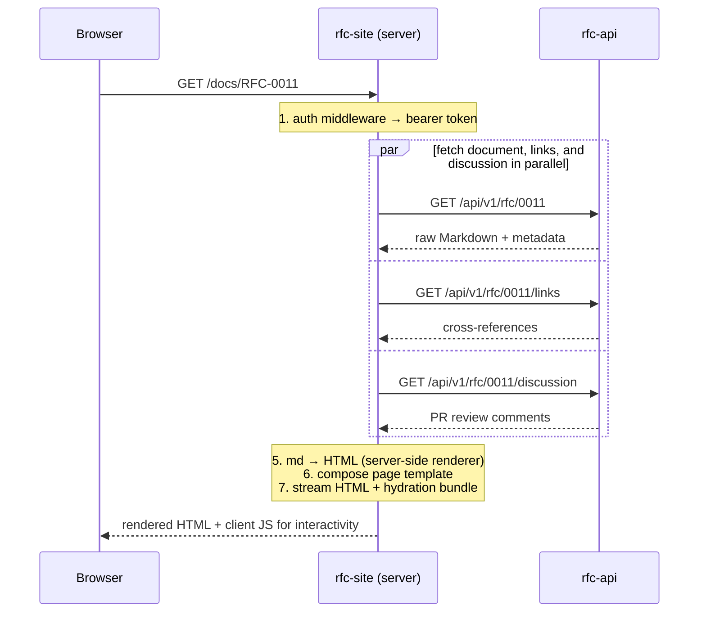
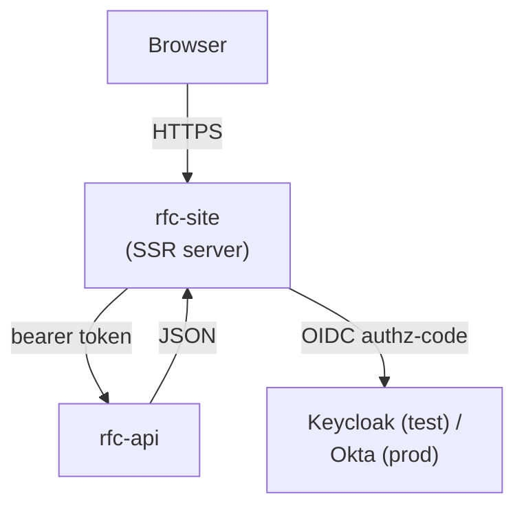

<!-- markdownlint-disable-file MD025 MD041 -->

# RFC 0002: rfc-site: Web Frontend for the Markdown Portal

**Status:** Draft **Author:** Donald Gifford **Date:** 2026-04-18

<!--toc:start-->

- [Summary](#summary)
- [Problem Statement](#problem-statement)
- [Proposed Solution](#proposed-solution)
- [Design](#design)
  - [Scope](#scope)
  - [Rendering model: server-side Markdown → HTML](#rendering-model-server-side-markdown--html)
  - [Data flow](#data-flow)
  - [Auth integration](#auth-integration)
  - [Search UX](#search-ux)
  - [PR discussion rendering](#pr-discussion-rendering)
  - [Technology choices (summary)](#technology-choices-summary)
  - [Relationship to other components](#relationship-to-other-components)
- [Alternatives Considered](#alternatives-considered)
- [Implementation Phases](#implementation-phases)
  - [Phase 1: Directory + single-doc read-only MVP](#phase-1-directory--single-doc-read-only-mvp)
  - [Phase 2: Search and cross-references](#phase-2-search-and-cross-references)
  - [Phase 3: PR discussions and polish](#phase-3-pr-discussions-and-polish)
  - [Phase 4: OIDC login (Keycloak → Okta)](#phase-4-oidc-login-keycloak--okta)
- [Risks and Mitigations](#risks-and-mitigations)
- [Open Questions](#open-questions)
- [Success Criteria](#success-criteria)
- [References](#references)
<!--toc:end-->

## Summary

`rfc-site` is the web frontend for the Markdown Portal described in [RFC-0011:
Markdown Portal][rfc-0011]. It is the human-facing read surface of the portal: a
web app that lists documents, renders them as HTML, exposes corpus-wide search,
and displays PR discussions alongside each document.

`rfc-site` consumes [`rfc-api`][rfc-0001] over HTTP and has no direct access to
GitHub, the database, or the search index. **Markdown rendering happens on the
site's server tier, not in `rfc-api`.** This split is deliberate and is the
headline commitment of this RFC.

## Problem Statement

[RFC-0011][rfc-0011] commits to a Git-based, PR-driven documentation workflow
modeled on Oxide's RFD system. RFC-0001 scopes the backend (`rfc-api`) as a data
service that stores raw Markdown and serves it over a JSON API. Neither of those
documents defines the read-facing website that non-developers actually use,
which is the whole point of having a portal at all.

`rfc-site` exists to be that website. The questions this RFC answers are:

1. What does the frontend do, as distinct from the API?
2. Where does Markdown rendering happen?
3. How does it integrate with auth, search, and PR discussion?
4. What guarantees does it take on versus delegate back to `rfc-api`?

## Proposed Solution

A server-rendered web application that:

1. **Renders Markdown on its own server tier.** On every request for a document
   view, `rfc-site`'s server-side handler fetches the raw Markdown body from
   `rfc-api` and renders it to HTML in-process before streaming the response to
   the browser. The browser receives rendered HTML plus hydrating client-side
   scripts.
2. **Consumes `rfc-api` over HTTP**, using the same public JSON contract that
   the MCP server and any other programmatic client uses. `rfc-site` is not
   privileged — it just happens to be the biggest consumer.
3. **Integrates with the same external IdP** (Keycloak in dev/test, Okta in
   production) that `rfc-api` validates against. Sessions are handled
   server-side on the site; the bearer token goes upstream to the API.
4. **Exposes search and PR discussions** as first-class UI, backed by
   `/api/v1/search` and `/api/v1/{type}/{id}/discussion` respectively.

This RFC does **not** pick a specific frontend framework, hosting shape, or
design system. Those are follow-on ADR and design-doc decisions. The commitment
this RFC makes is architectural: a server-rendered site that is the sole
renderer of Markdown, with no direct upstream access and a single API
dependency.

## Design

### Scope

In scope for `rfc-site`:

- Document browse and directory views (all documents, by type, by status, by
  label).
- Single-document views rendered server-side from raw Markdown.
- Search UI with keyboard-first UX, backed by `/api/v1/search`.
- Cross-reference navigation using `/api/v1/{type}/{id}/links`.
- PR discussion rendering alongside each document, sourced from
  `/api/v1/{type}/{id}/discussion`.
- SSO / login flow with the external IdP.
- Deploy on the existing Kubernetes cluster.

Out of scope for `rfc-site`:

- **Content storage or sync.** Owned by `rfc-api` ([RFC-0001][rfc-0001]).
  `rfc-site` does not clone repos, does not read Postgres, does not address
  Meilisearch directly, and does not call the GitHub API.
- **Authoring.** Same as `rfc-api` — authoring happens in Git.
- **The MCP server.** Separate component; consumes `rfc-api`, not `rfc-site`.
- **Design system.** RFC-0012 (per [RFC-0011][rfc-0011]). `rfc-site` is a
  consumer of the design system, not the design system.
- **Token issuance and user management.** Owned by the external IdP.

### Rendering model: server-side Markdown → HTML

**Explicit commitment:** Markdown-to-HTML rendering lives in `rfc-site`'s server
tier, not in `rfc-api` and not in the browser.

On each view request, the site's server-side handler:

1. Fetches the document from `rfc-api` (`GET /api/v1/{type}/{id}`, e.g.
   `/api/v1/rfc/0011`, returning the raw Markdown body plus metadata).
2. Runs the Markdown body through a Markdown pipeline (parser + renderer)
   in-process.
3. Composes the rendered HTML with navigation, metadata panels, and TOC into the
   full page.
4. Streams the response to the browser; the client hydrates for interactivity
   (TOC scroll-tracking, copy-to-clipboard, search focus, keyboard shortcuts).

Rationale for making this explicit:

- **`rfc-api` stays content-agnostic.** It serves raw Markdown to all consumers.
  Rendering opinions (theme, syntax highlighting, heading-anchor strategy,
  Mermaid rendering, admonition styles) live in one place: the frontend.
- **The MCP server and other API consumers get raw Markdown**, which is what
  LLMs and tooling actually want.
- **Consistency with the validated Oxide model.** Per [INV-0001][inv-0001],
  `rfd-site` does all AsciiDoc rendering in its Node loader and `rfd-api` never
  emits HTML. Our design mirrors that shape with Markdown instead of AsciiDoc.
- **Rendering-pipeline changes do not require API changes.** A theme refresh,
  new admonition style, or a better code-block highlighter is a `rfc-site`
  deploy, not a backend migration.

Constraints on the rendering pipeline:

- Must render from a single Markdown string plus document metadata — no extra
  HTTP calls per block, no pre-compiled HTML from the API.
- Must be safe: rendered HTML is sanitized; no user-supplied scripts execute; no
  arbitrary remote URLs are fetched at render time.
- Must support code blocks with syntax highlighting, Mermaid diagrams, and at
  least `admonition` and `tables` Markdown extensions (matching `.docz.yaml`
  configuration in this repo).
- Should be cacheable at the HTTP layer of `rfc-site`; the cost of rerendering
  is acceptable per-request but avoidable with standard response caching.

### Data flow

Key properties:

- The browser talks **only** to `rfc-site`.
- `rfc-site` talks **only** to `rfc-api`.
- Neither talks to GitHub, Postgres, or Meilisearch directly.

### Auth integration

- **IdP:** Keycloak in dev/test; Okta in production. Same IdP that backs
  `rfc-api`'s bearer-token validation (per RFC-0001 §Technology choices).
- **Flow:** OIDC authorization-code with PKCE against the IdP. `rfc-site` acts
  as the confidential client. On successful login it stores the session
  server-side (signed cookie referencing a server-held session store or a JWT —
  mechanism is a design-doc detail).
- **Upstream auth:** `rfc-site` presents the user's access token (or a
  site-issued token representing the user) to `rfc-api` on each upstream
  request. `rfc-api` validates it locally against the IdP's JWKS.
- **Access control:** Authorization is enforced by `rfc-api`; the site's UI
  gating is cosmetic. If the API returns 403, the site shows a "not available"
  state; it does not try to render what the user cannot see.
- **v1 parity with RFC-0001:** v1 remains internal-network only; full OIDC lands
  in Phase 3 of this RFC, tracking Phase 4 of RFC-0001.

### Search UX

- UI: keyboard-first search overlay (Cmd/Ctrl-K style), accessible from every
  page.
- Implementation: the overlay issues queries to `rfc-site`'s own server
  endpoint, which proxies to `rfc-api`'s `GET /api/v1/search`. Results are
  per-section hits (headings within documents), matching the index shape that
  `rfc-api` exposes (see [ADR-0003][adr-0003]).
- No direct Meilisearch client in the browser or on the site server; the site is
  agnostic to the search backend.

### PR discussion rendering

- On each document view, `rfc-site` fetches `/api/v1/{type}/{id}/discussion` and
  renders it alongside the document body. Rendering layout (inline vs. sidebar
  vs. tab) is a design-doc decision.
- Because discussions are persisted in `rfc-api` (per RFC-0001), the site does
  **not** call GitHub directly. This is an intentional departure from Oxide's
  model, where `rfd-site` fetches comments via GitHub's API. Our model means MCP
  and other consumers see the same discussion context.

### Technology choices (summary)

- **Framework:** Deferred to a follow-up ADR (`ADR-0004`, provisional).
  Candidates include SvelteKit, Next.js, Remix / React Router v7, and Astro.
  Selection criteria will be: first-class server-side rendering, streamable
  responses, ergonomics for a small-to-medium TS team, and deployability on
  Kubernetes without vendor lock-in to a specific edge platform.
- **Markdown pipeline:** Deferred. Likely a `remark`/`rehype` chain (TS) or
  equivalent; picked when the framework is picked.
- **Deployment:** Kubernetes. Packaged as a Helm chart, deployed via Argo CD in
  the same cluster and namespace as `rfc-api`. Separate Deployment from
  `rfc-api` so they scale and roll independently.
- **Observability:** Platform defaults — structured logs, request tracing,
  health/readiness probes.

### Relationship to other components

See [RFC-0001 §Relationship to other components][rfc-0001] for the full diagram.
`rfc-site`'s slice:

## Alternatives Considered

1. **Render Markdown in `rfc-api` and serve HTML.** Rejected. The MCP server and
   other programmatic consumers want raw Markdown; coupling `rfc-api` to an HTML
   pipeline bakes a frontend concern into the backend contract and ties API
   deploys to theme tweaks. This is the Oxide shape ([INV-0001][inv-0001]) and
   we keep it.
2. **Client-side rendering (SPA that fetches raw Markdown and renders in the
   browser).** Rejected. Costs first-paint time, makes SEO and link previews
   noticeably worse, and ships a full Markdown parser to every client. Marginal
   developer ergonomics benefit does not justify the UX regression.
3. **Static site generation: prebuild all docs to HTML and host static.**
   Attractive for a pure reader experience. Rejected because search, auth-gated
   content, and discussion freshness all require dynamic behaviour that SSG
   would undo. Full rebuilds on every merge also couple the build pipeline to
   the content repo in a way the API/worker split was designed to avoid.
4. **Fold the frontend into `rfc-api`** (one Go binary serves HTML). Rejected
   for the same reason RFC-0001 rejects bundling the API into the frontend —
   conflates two skill sets and two deploy cadences, and forecloses non-browser
   consumers from hitting the same contract.
5. **Fetch PR discussions from GitHub directly on the site** (Oxide's model).
   Rejected. Leaves discussions invisible to MCP and to other API consumers, and
   ties view latency to GitHub API health. Persisting them in `rfc-api`
   (RFC-0001) is the chosen design.
6. **Skip SSR; server-render only the shell, client-render the body.** Partial
   credit — solves SEO for the shell but not for the document body, which is the
   interesting content. Rejected.

## Implementation Phases

### Phase 1: Directory + single-doc read-only MVP

Framework pick (ADR-0004), basic directory view, server-side Markdown rendering
for single documents, no auth (internal-network only), no search, no
discussions. Goal: prove the SSR + API shape end-to-end.

### Phase 2: Search and cross-references

Add the search overlay and cross-reference navigation, consuming
`/api/v1/search` and `/api/v1/{type}/{id}/links`. Tracks Phase 2 of RFC-0001.

### Phase 3: PR discussions and polish

Add discussion rendering in the document view. Polish rendering pipeline
(Mermaid, syntax highlighting, admonitions). Performance passes.

### Phase 4: OIDC login (Keycloak → Okta)

Wire the OIDC authorization-code flow against Keycloak in dev/test, Okta in
production. Add login-gated views and handle 403s gracefully. Tracks Phase 4 of
RFC-0001.

## Risks and Mitigations

| Risk                                                  | Impact | Likelihood | Mitigation                                                                                                                    |
| ----------------------------------------------------- | ------ | ---------- | ----------------------------------------------------------------------------------------------------------------------------- |
| SSR latency dominates TTFB as corpus grows            | Medium | Medium     | Response caching at `rfc-site`; render is pure function of API payload so cache keys are trivial                              |
| Framework choice locks us in for years                | Medium | Medium     | Keep Markdown pipeline framework-agnostic; keep API client generated from the contract; resist framework-specific data layers |
| Rendering fidelity regressions on Markdown edge cases | Medium | Medium     | Golden-file tests for rendering over a fixed corpus; regression tests run in CI                                               |
| Discussion freshness lags GitHub noticeably           | Low    | Medium     | Surface a "synced at" timestamp in the UI; accept staleness as a trade for MCP visibility                                     |
| XSS via author-supplied Markdown                      | High   | Low        | Sanitize rendered HTML; no raw HTML passthrough unless a well-scoped allowlist is justified later                             |
| IdP outage blocks browser logins                      | Medium | Low        | Cache IdP discovery + JWKS; keep unauthenticated internal-network path as break-glass                                         |

## Open Questions

1. **Framework.** SvelteKit vs. Next.js vs. Remix / React Router v7 vs. Astro.
   Resolved in ADR-0004 (to be written).
2. **Markdown pipeline.** `remark`/`rehype`, `markdown-it`, or
   framework-provided default. Follow-on to the framework choice.
3. **Session storage.** Signed cookie referencing server state vs. stateless
   JWT. Design-doc decision.
4. **Discussion rendering layout.** Inline with document, sidebar, or tab. UX
   decision, tracked in the RFC-0012 design-system RFC or a site-specific design
   doc.
5. **Caching strategy.** In-memory per-pod vs. shared cache (Redis) vs. plain
   HTTP caching. Design-doc decision, informed by real usage patterns.

## Success Criteria

- Every document view is server-rendered: the first byte received by the browser
  contains the document's rendered HTML.
- `rfc-site` has exactly one outbound dependency at runtime: `rfc-api`. No
  direct calls to GitHub, Postgres, or Meilisearch.
- A rendering-pipeline change (new syntax highlighter, theme, Markdown
  extension) ships as a `rfc-site` deploy with no `rfc-api` change.
- Search results are identical whether invoked from the site UI or from an MCP
  client, because both hit the same API endpoint.
- A user sees the PR discussion for a document without the site calling GitHub
  on their behalf.

## References

- [RFC-0011: Markdown Portal][rfc-0011] — parent RFC.
- [RFC-0001: rfc-api — Backend API for the Markdown Portal][rfc-0001] — sibling
  RFC; the service this frontend consumes.
- [INV-0001: Oxide RFD system — architecture case study][inv-0001] — the
  reference architecture. Our rendering-on-the-frontend choice comes directly
  from this.
- [ADR-0001: Use Go and the standard library net/http for rfc-api][adr-0001]
- [ADR-0002: Use PostgreSQL as the rfc-api datastore][adr-0002]
- [ADR-0003: Use Meilisearch for rfc-api search][adr-0003]

[rfc-0001]: ./0001-rfc-api-backend-api-for-the-markdown-portal.md
[rfc-0011]: ../../INGEST_RFC.md
[inv-0001]: ../investigation/0001-oxide-rfd-system-architecture-case-study.md
[adr-0001]: ../adr/0001-use-go-and-stdlib-net-http-for-rfc-api.md
[adr-0002]: ../adr/0002-use-postgresql-as-the-rfc-api-datastore.md
[adr-0003]: ../adr/0003-use-meilisearch-for-rfc-api-search.md
